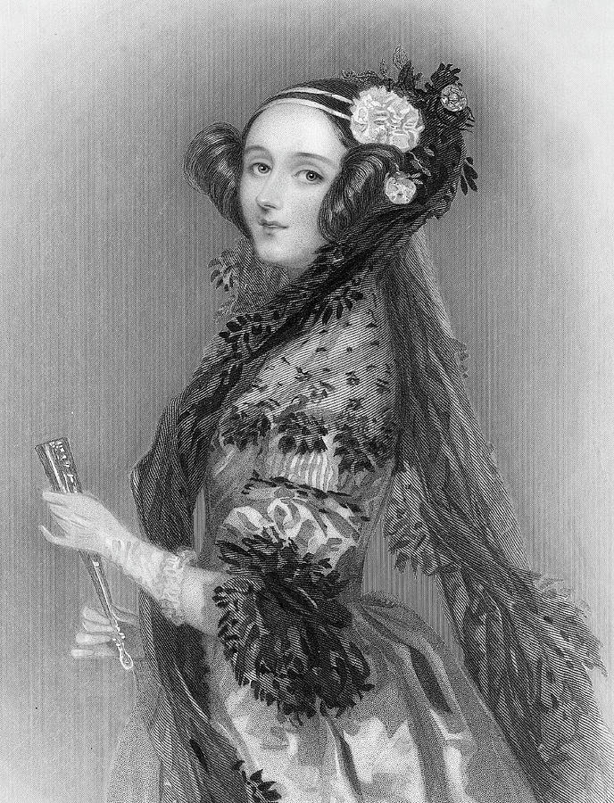

# countess-of-lovelace
Organize my computer science studies, and honoring the first woman to write a computer program.

"**Augusta Ada King, Countess of Lovelace** (_[née](https://en.wikipedia.org/wiki/N%C3%A9e "Née")_ **Byron**; 10 December 1815 – 27 November 1852) was an English mathematician and writer, chiefly known for her work on [Charles Babbage](https://en.wikipedia.org/wiki/Charles_Babbage "Charles Babbage")'s proposed mechanical general-purpose [computer](https://en.wikipedia.org/wiki/Computer "Computer"), the [Analytical Engine](https://en.wikipedia.org/wiki/Analytical_Engine "Analytical Engine"). She was the first to recognise that the machine had applications beyond pure calculation, and to have published the first [algorithm](https://en.wikipedia.org/wiki/Algorithm "Algorithm") intended to be carried out by such a machine. As a result, she is often regarded as the first computer [programmer](https://en.wikipedia.org/wiki/Programmer "Programmer")"
